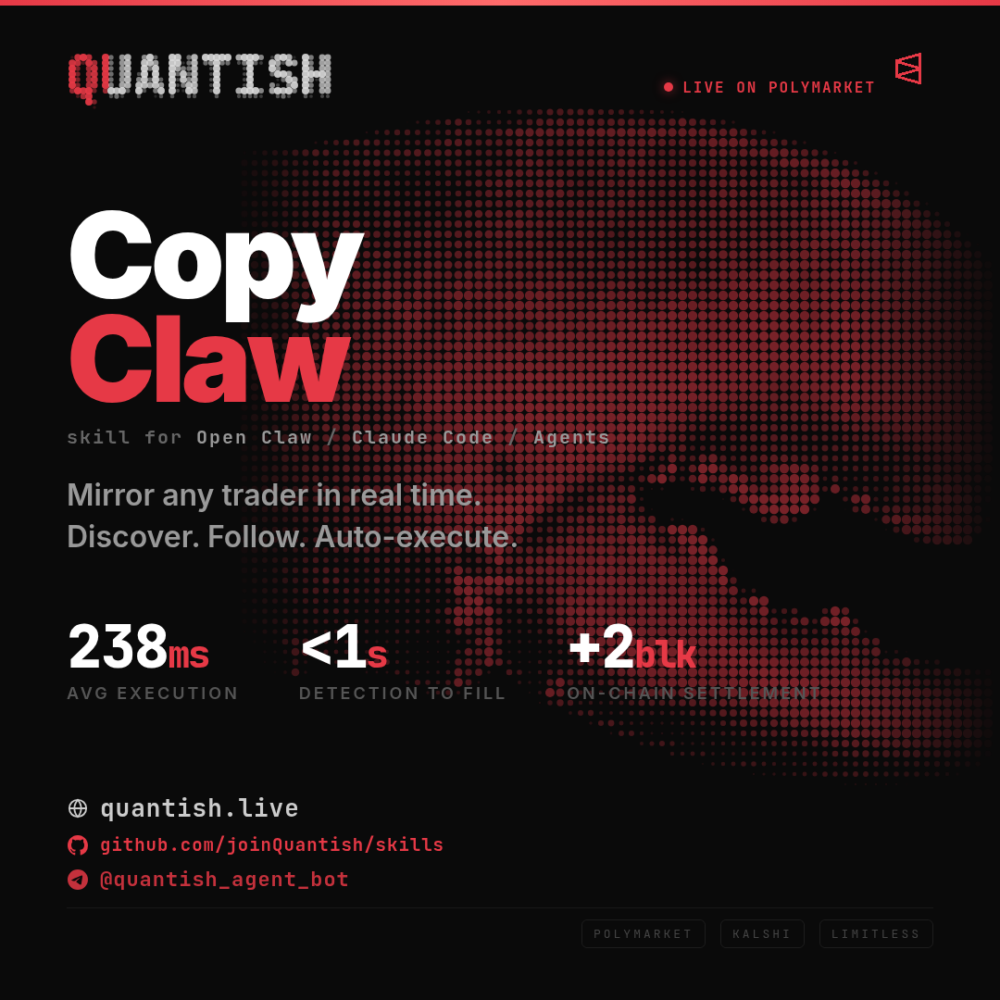

<p align="center">
  
</p>

# CopyClaw

> **⚠️ Notice: Quantish is winding down.** The Quantish platform (quantish.live) is shutting down. This project is no longer being maintained. For real-time prediction market data infrastructure, check out [polynode.dev](https://polynode.dev).

A [Claude Code skill](https://code.claude.com/docs/en/skills) for copy trading on Polymarket. Mirror any trader's buys and sells automatically with sub-2-second execution.

## What It Does

- Discover top Polymarket traders by PNL or volume
- Follow any wallet and auto-mirror their trades in real time
- WebSocket-based detection, Fill-or-Kill execution
- Configurable sizing: fixed amount, percentage, or exact mirror

## Install

```bash
# Clone to your skills directory
git clone https://github.com/joinQuantish/copyclaw.git ~/.claude/skills/copyclaw
```

Then restart Claude Code.

## Usage

```
/copyclaw
```

Claude walks you through the full setup: MCP server connection, wallet creation, funding, trader discovery, and copy trading configuration.

## How It Works

1. Connects to the [Polymarket MCP server](https://github.com/joinQuantish/polymarket-mcp) via SSE
2. Creates a Gnosis Safe wallet on Polygon with gasless relayer
3. Streams every Polymarket trade via RTDS WebSocket
4. When a followed trader trades, places an identical order in <2 seconds

## Requirements

- [Claude Code](https://claude.com/claude-code)
- The skill handles MCP server setup, wallet creation, and everything else

## Allocation Modes

| Mode | What It Does | Example |
|------|-------------|---------|
| `FIXED_AMOUNT` | Spend a set dollar amount per trade | $2 per trade regardless of target size |
| `PERCENTAGE` | Copy a percentage of the target's trade | 50% = target buys $100, you buy $50 |
| `MIRROR_SIZE` | Match the exact share count | Target buys 10 shares, you buy 10 |

## Links

- [Quantish](https://quantish.live)
- [Polymarket MCP Server](https://github.com/joinQuantish/polymarket-mcp)
- [All Quantish Skills](https://github.com/joinQuantish/skills)

## License

MIT
